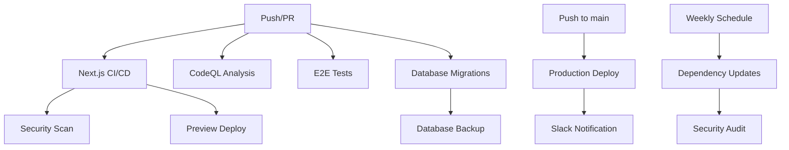

# CI/CD Workflows

This directory contains GitHub Actions workflows for automated testing, building, and deployment of the Fashion Marketplace application.

## Workflows Overview

### 🔄 Next.js CI/CD (`webpack.yml`)
**Triggers:** Push/PR to `master`, `main`, `develop`
- **Build & Test:** Multi-node testing (18.x, 20.x)
- **Linting:** ESLint checks
- **Type Checking:** TypeScript validation
- **Security Scan:** npm audit + Snyk security scanning
- **Preview Deploy:** Vercel preview for PRs

### 🛡️ CodeQL Security Analysis (`codeql.yml`)
**Triggers:** Push/PR to `master`, `main`, `develop` + Weekly schedule
- **Security Scanning:** Advanced security analysis using CodeQL
- **Language:** JavaScript/TypeScript
- **Queries:** Security extended + quality checks

### 🧪 E2E Tests (`e2e-tests.yml`)
**Triggers:** Push/PR to `master`, `main`, `develop` + Manual
- **Playwright Tests:** End-to-end testing with sharding
- **Lighthouse CI:** Performance and accessibility testing
- **Artifacts:** Test reports and videos

### 🚀 Production Deployment (`deploy-production.yml`)
**Triggers:** Push to `master`, `main`
- **Environment:** Production
- **Deployment:** Vercel production deployment
- **Notifications:** Slack integration

### 📦 Dependency Updates (`dependency-updates.yml`)
**Triggers:** Weekly schedule + Manual
- **Automated PRs:** Dependency update pull requests
- **Security Audit:** Vulnerability scanning
- **Issue Creation:** Security alerts for vulnerabilities

### 🗄️ Database Migrations (`database-migrations.yml`)
**Triggers:** Migration file changes + Manual
- **Validation:** Migration file checks
- **Staging:** Safe migration testing
- **Production:** Automated deployment
- **Backup:** Database backups before changes

### 📊 Datadog Synthetics (`datadog-synthetics.yml`)
**Triggers:** Push/PR to `master`, `main`
- **Synthetic Tests:** End-to-end monitoring
- **Optional:** Only runs if secrets are configured

## Required Secrets

### Vercel Deployment
```bash
VERCEL_TOKEN=your_vercel_token
VERCEL_ORG_ID=your_org_id
VERCEL_PROJECT_ID=your_project_id
```

### Supabase Database
```bash
SUPABASE_ACCESS_TOKEN=your_supabase_token
SUPABASE_PROJECT_REF=your_project_ref
SUPABASE_STAGING_PROJECT_REF=your_staging_ref
```

### Security & Monitoring
```bash
SNYK_TOKEN=your_snyk_token
DD_API_KEY=your_datadog_api_key
DD_APP_KEY=your_datadog_app_key
SLACK_WEBHOOK_URL=your_slack_webhook
```

## Setup Instructions

### 1. Enable GitHub Actions
- Go to your repository Settings → Actions → General
- Enable "Allow all actions and reusable workflows"

### 2. Configure Secrets
- Go to Settings → Secrets and variables → Actions
- Add all required secrets listed above

### 3. Set up Branch Protection
- Go to Settings → Branches
- Add rule for `master`/`main` branch:
  - Require status checks to pass
  - Require branches to be up to date
  - Require pull request reviews

### 4. Configure Environments
- Go to Settings → Environments
- Create `production` environment
- Add required protection rules

## Workflow Dependencies



## Testing Strategy

### Unit Tests
- Run during build process
- TypeScript compilation checks
- ESLint validation

### Integration Tests
- API endpoint testing
- Database connection tests
- External service integration

### E2E Tests
- Playwright browser testing
- User journey validation
- Cross-browser compatibility

### Performance Tests
- Lighthouse CI analysis
- Core Web Vitals monitoring
- Load testing for critical paths

## Deployment Strategy

### Preview Deployments
- Automatic for all PRs
- Vercel preview environments
- URL shared in PR comments

### Staging Deployments
- Manual trigger available
- Database migration testing
- Full integration testing

### Production Deployments
- Automatic on merge to main
- Database backup before deployment
- Rollback capability
- Slack notifications

## Monitoring & Alerts

### Security Monitoring
- CodeQL security analysis
- Dependency vulnerability scanning
- Automated security issue creation

### Performance Monitoring
- Lighthouse CI integration
- Core Web Vitals tracking
- Performance regression detection

### Application Monitoring
- Datadog synthetic tests
- Error tracking and alerting
- Uptime monitoring

## Troubleshooting

### Common Issues

1. **Build Failures**
   - Check Node.js version compatibility
   - Verify all dependencies are installed
   - Review TypeScript compilation errors

2. **Deployment Failures**
   - Verify Vercel credentials
   - Check environment variables
   - Review build logs

3. **Database Migration Issues**
   - Validate migration syntax
   - Check Supabase credentials
   - Review migration conflicts

4. **Test Failures**
   - Check test environment setup
   - Verify external service availability
   - Review test data consistency

### Debug Commands

```bash
# Local testing
npm run lint
npm run build
npx tsc --noEmit

# Database operations
supabase db push
supabase db reset

# E2E testing
npx playwright test
npx playwright show-report
```

## Best Practices

### Code Quality
- Always run linting before committing
- Fix TypeScript errors before merging
- Write meaningful commit messages

### Security
- Never commit secrets to repository
- Regularly update dependencies
- Review security scan results

### Testing
- Write tests for new features
- Maintain test coverage
- Use descriptive test names

### Deployment
- Test in staging before production
- Monitor deployment metrics
- Have rollback procedures ready

## Support

For issues with CI/CD workflows:
1. Check workflow logs in GitHub Actions
2. Review this documentation
3. Create an issue with detailed error information
4. Contact the development team 